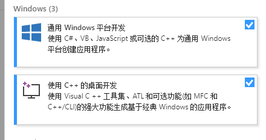
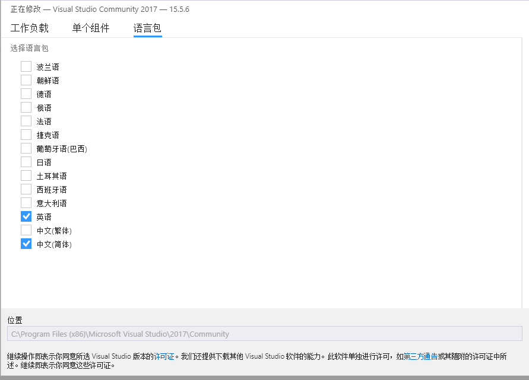
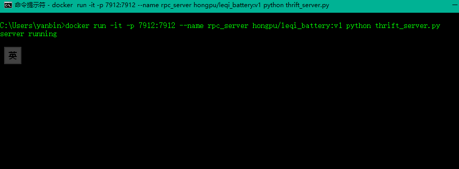
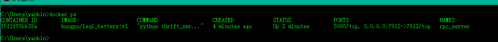
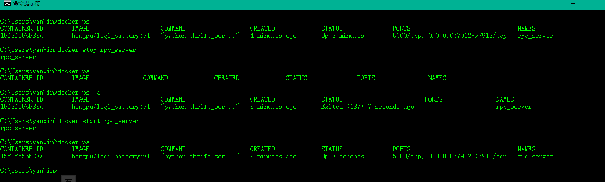
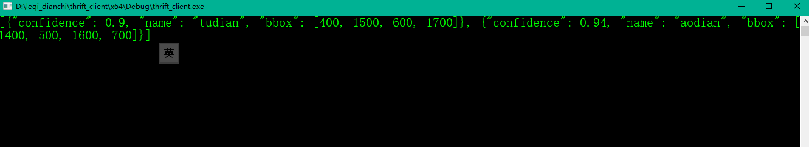

# 视觉检测SaaS集成方案示例
### Steps To Run.
    requirements：Visual Studio 2017 or Visual Studio 2015 Update 3;
                  vcpkg;
                  thrift;
### step1:
   [download vs 2017 community installer](https://download.visualstudio.microsoft.com/download/pr/11503720/045b56eb413191d03850ecc425172a7d/vs_Community.exe)
      
    安装vs2017 CE，
    确认勾选了英文语言包
   
   
   
   
### step2：
   [download vcpkg](https://github.com/Microsoft/vcpkg)
   
    安装vcpkg
    ---
    最好系统只有一个vs2017版本，有多个版本可能选择错误的vs导致报错，不相关的vs版本可以先删除path中的路径，
    ---
    下载后放在 C:/vcpkg
    将 C:/vcpkg 加入系统 path
    双击运行 C:/vcpkg/bootstrap-vcpkg.bat,运行成功会生成C:/vcpkg/vcpkg.exe
    管理员权限运行cmd
    vcpkg integrate install

### step3：安装thrift vc++开发包
    vcpkg install thrift:x64-windows
    
### step4：安装Docker
   [download docker](https://download.docker.com/win/stable/Docker%20for%20Windows%20Installer.exe)

   点击安装，提示激活Hyper-V，确认重启即可。
   可选择开机自启。

### step5：启动服务
    启动cmd
    docker run -it -p 7912:7912 --name rpc_server hongpu/leqi_battery:v1 python thrift_server.py (只需运行一次)
   

    docker ps 可以看到正在运行的container

   
    docker stop/start rpc_server 可以停止/启动 已经存在的container。

   

    docker logs rpc_server
    可以再次看到server running

### step6：运行c++ 客户端测试连接 
    vs 2017打开 /leqi_dianchi/thrift_client/thrift_client.sln
    选择x64配置，编译运行。
   

## thrift 在vs 2005 下的客户端
    原生thrift不支持 vs 2005, 经过技术定制，client_cxx_vs2005中实现了 vs 2005的测试客户端，直接打开 vs2005.sln可直接编译运行。
